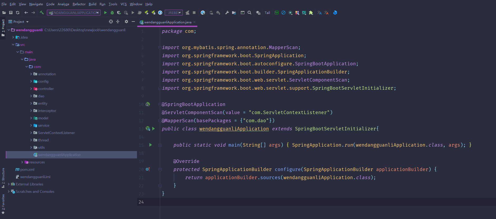
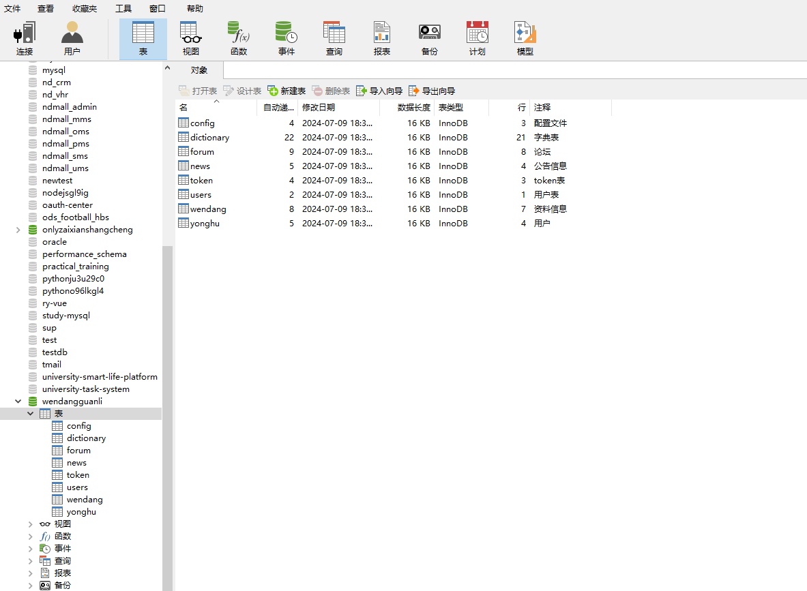
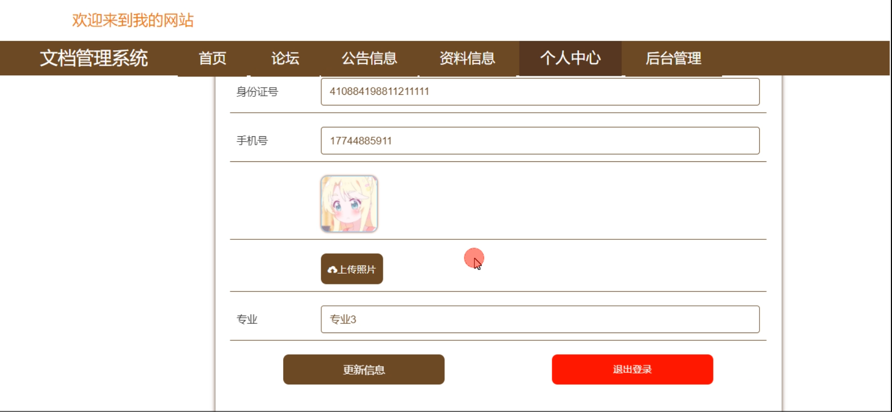
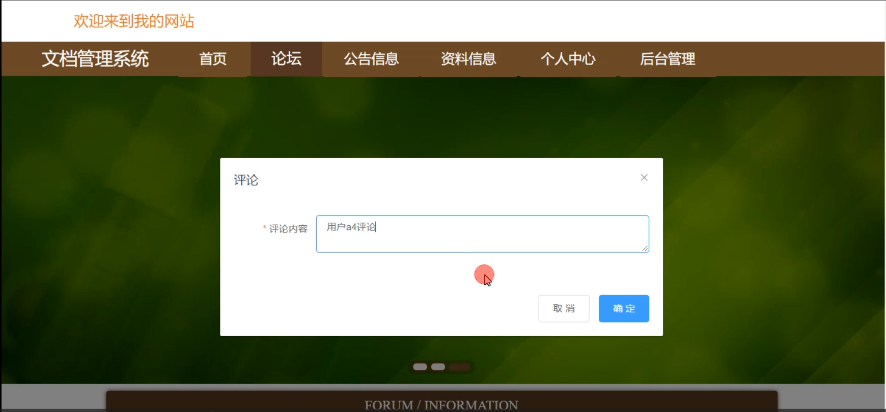
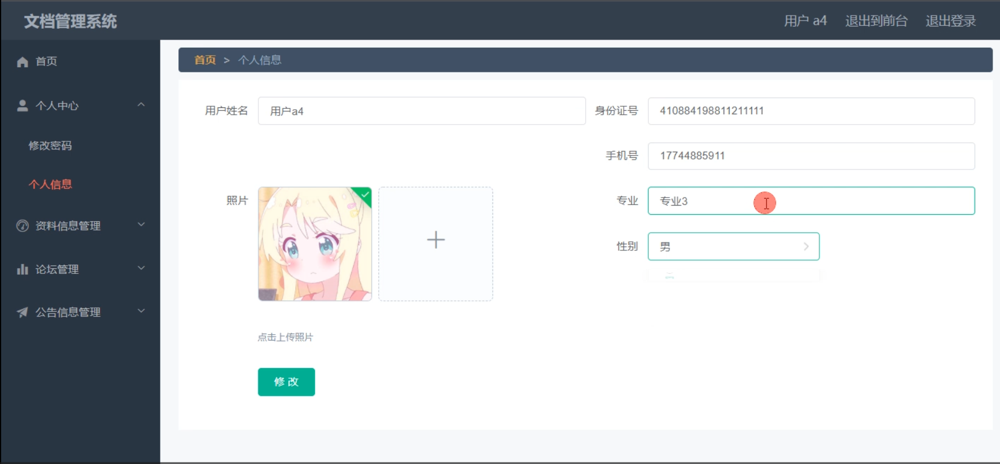
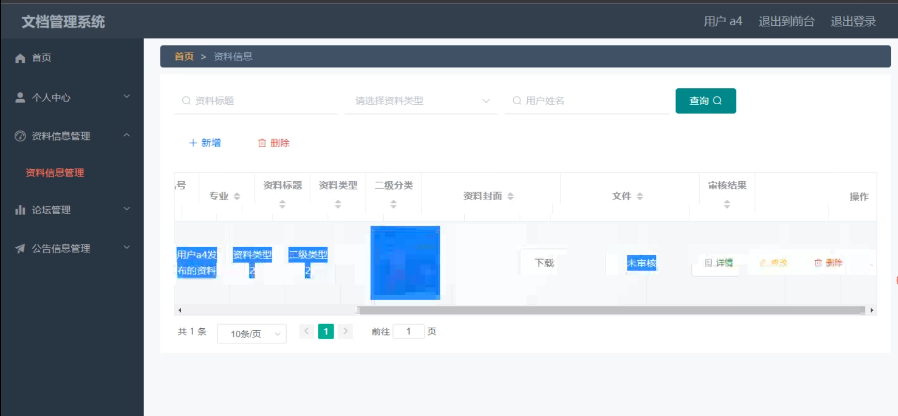
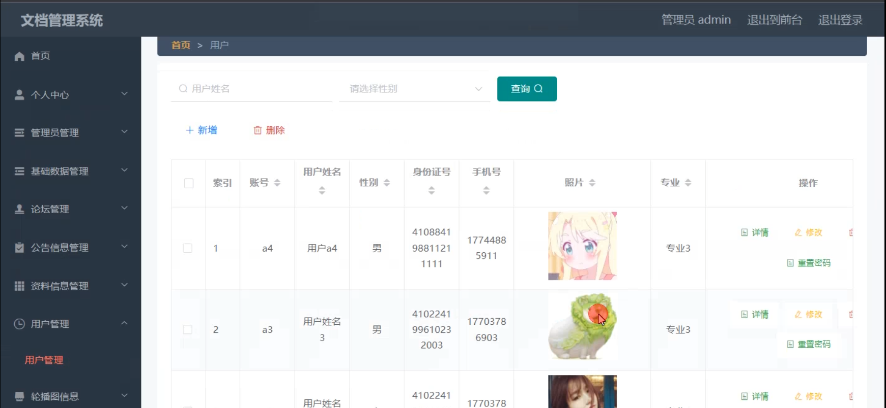
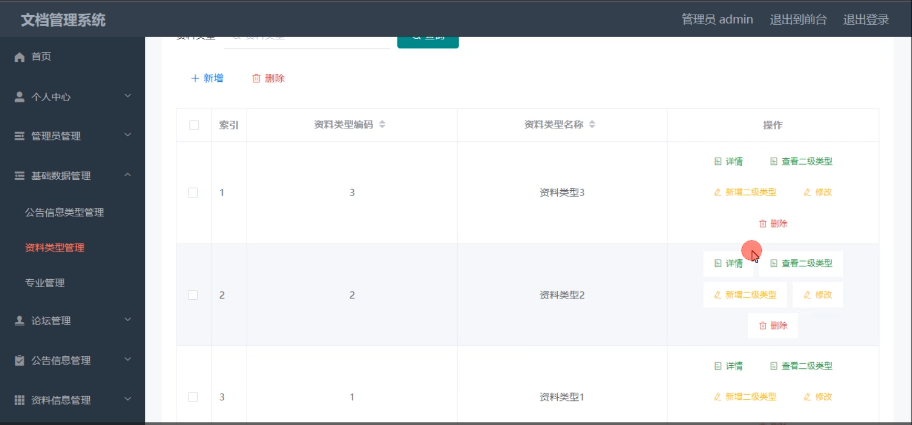
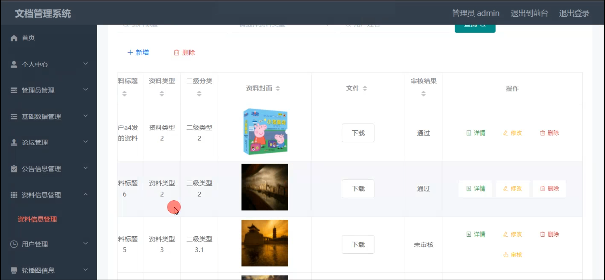

# 基于springboot的江理工文档管理系统

#### 介绍

随着江苏理工学院（以下简称江理工）的不断发展，各类文档资料的数量和种类日益增多，管理的复杂性也随之增加。为了提高文档管理的效率和规范性，我们开发了这个基于 Spring Boot 的江理工文档管理系统。该系统旨在为管理员和用户提供一个便捷、高效、安全的文档管理平台，满足学校对文档管理的各种需求。

#### 技术栈

后端技术栈：Springboot+Mysql+Maven

前端技术栈：Vue+Html+Css+Javascript+ElementUI

开发工具：Idea+Vscode+Navicate

#### 系统功能介绍

（一）管理员角色  
个人中心：管理员在此可以查看和修改个人的基本信息，如联系方式、密码等，同时能够查看自己的操作日志和系统通知。  
管理员管理：对其他管理员的账号进行管理，包括新增管理员、修改管理员权限、删除管理员账号等，以确保管理员团队的合理配置和权限分配。  
基础数据管理：负责维护系统运行所需的基础数据，如文档分类、标签、存储路径等，为文档的准确分类和高效检索提供支持。  
论坛管理：监督论坛的交流内容，包括审核发布的帖子、删除违规或不当的言论、回复用户的问题和建议，以保障论坛的良好氛围和秩序。  
公告信息管理：发布、编辑和删除与文档管理相关的公告信息，如系统维护通知、新政策解读、重要活动安排等，确保用户及时获取关键信息。  
资料信息管理：对各类文档资料进行全面管理，包括文档的上传、下载、编辑、删除、审核等操作，同时可以设置文档的访问权限和保密级别。  
用户管理：对系统用户进行管理，包括注册审批、用户信息修改、用户权限设置、用户账号停用或启用等，保障系统的安全性和用户使用的合理性。  
轮播图信息：设置系统首页的轮播图内容，用于展示重要文档推荐、热门活动宣传、学校形象展示等，吸引用户的关注。  

（二）用户角色   
论坛：用户可以在论坛中与其他用户交流文档管理的经验、心得，或者提出问题和建议，促进用户之间的互动和知识共享。  
公告信息：及时查看管理员发布的各种公告信息，了解系统动态和学校相关政策的变化。  
资料信息：上传、下载和查看自己所需的文档资料，按照权限对文档进行相应的操作。  
个人中心：修改个人资料、查看自己的文档操作记录、管理自己在论坛发布的内容等。  
后台管理  
资料信息管理：对自己上传的文档资料进行管理，如修改、删除等。  
论坛管理：查看和管理自己在论坛中发布的帖子和回复。  
公告信息管理：回顾已发布的公告内容。  

#### 系统作用

江理工文档管理系统的主要作用包括：  

提升管理效率： 为管理员提供全面的管理工具，帮助高效管理资料信息、公告、论坛和基础数据，确保信息的准确性和及时性。  
方便用户操作： 提供简洁直观的界面，让用户可以便捷地浏览和发布资料信息、参与论坛讨论、查看公告和管理个人信息，提升用户体验。  
信息透明化： 通过公告、论坛和轮播图信息，管理员和用户可以及时传递和接收重要信息，增强信息的透明度和沟通效率。  
资源合理利用： 通过系统化的管理，确保资料信息的合理记录和使用，避免信息遗漏和资源浪费。  

#### 系统功能截图

代码结构

数据库表

登录

个人中心

资料信息

论坛

前台页面首页

用户端后台管理

资料信息管理

管理员端用户管理

论坛管理

资料类型管理

资料信息管理

#### 总结

基于 Spring Boot 的江理工文档管理系统通过清晰的角色划分和丰富实用的功能模块，为江理工的文档管理工作带来了显著的提升。管理员能够有效地掌控和维护系统的运行，保障文档管理的规范性和安全性；用户能够便捷地获取和使用所需的文档资料，参与交流互动。该系统有助于优化学校的文档管理流程，提高管理效率和服务质量，为学校的发展提供有力的支持。

#### 使用说明

创建数据库，执行数据库脚本 修改jdbc数据库连接参数 下载安装maven依赖jar 启动idea中的springboot项目

前台登录页面
http://localhost:8080/wendangguanli/front/index.html

后台登录页面
http://localhost:8080/wendangguanli/admin/dist/index.html

管理员			账户:admin 	密码：admin
用户				账户:a1 		密码：123456
用户				账户:a2 		密码：123456
用户				账户:a3 		密码：123456